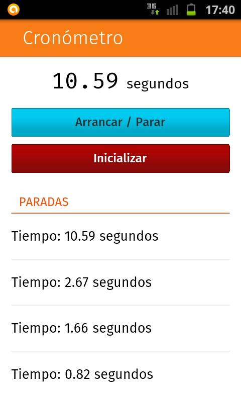

# Cronometro
Cronómetro en segundos con puntos de parada. Guarda los puntos de parada al cerrar la aplicación y los recupera al volver abrirla.

### Lenguajes
**Web App** creada con `HTML5`, `CSS3` y `JavaScript`. Diseño visual de *Firefox OS*.

### Uso
La **Web App** se compila a **Android** mediante **PhoneGap**, con el fichero `config.xml`, pero el código es compatible con cualquier plataforma que soporte los lenguajes.

### Screenshot

### License
**Cronometro** is licenced under the [MIT License](http://en.wikipedia.org/wiki/MIT_licence).
